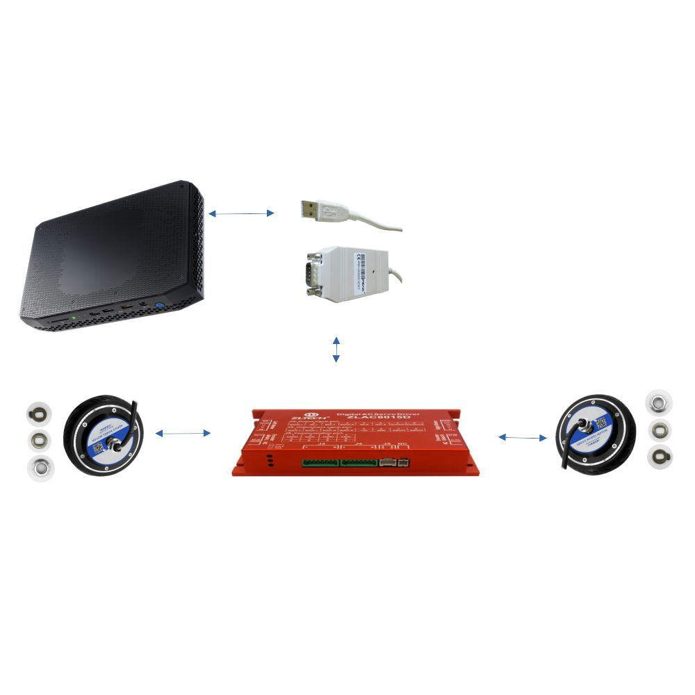

# d-bot-m2m-movement

dbot m2m movement package

## hardware  

Digital AC Servo driver\
ZLTECH ZLAC8015D  
<https://www.manualslib.com/manual/2488201/Zltech-Zlac8015d.html#manual>  


Computing  
Intel NUC 11

CAN
<https://www.peak-system.com/PCAN-USB.199.0.html?&L=1>



## installation

```bash
apt-get update  
apt-get install pip  
optional
pip3 install python-can[pcan]  
```

# test installation of pcan and zlac8015d

```bash
python3 src/pcan-zlac8015d-tester.py
```


## libraries

Pcan-basic library
<https://www.peak-system.com/PCAN-Basic.239.0.html?&L=1>

